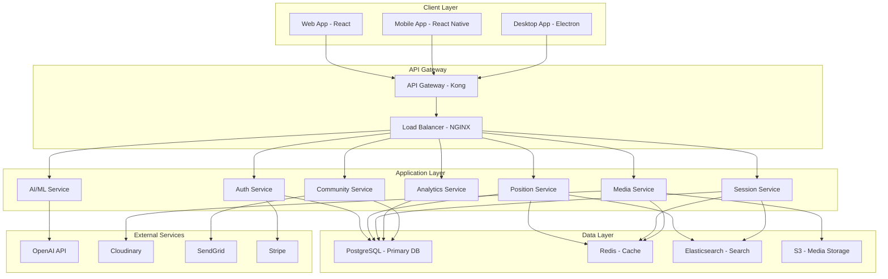

# Technical Architecture Document

## 🏗️ **System Architecture Overview**

This document outlines the comprehensive technical architecture for the enhanced Position Library platform, designed to support millions of users with advanced features including AI/ML, real-time analytics, and social community features.

---

## 📋 **Table of Contents**

1. [System Architecture](#system-architecture)
2. [Technology Stack](#technology-stack)
3. [Database Design](#database-design)
4. [API Architecture](#api-architecture)
5. [Security Architecture](#security-architecture)
6. [Performance Architecture](#performance-architecture)
7. [Scalability Architecture](#scalability-architecture)
8. [Monitoring & Observability](#monitoring--observability)
9. [Deployment Architecture](#deployment-architecture)
10. [Data Flow Architecture](#data-flow-architecture)

---

## 🏗️ **System Architecture**

### **High-Level Architecture**



### **Microservices Architecture**

#### **Core Services**
1. **Authentication Service**
   - User management
   - JWT token handling
   - OAuth integration
   - Role-based access control

2. **Position Service**
   - Position CRUD operations
   - Search and filtering
   - Recommendation engine
   - Content management

3. **Session Service**
   - Session management
   - Real-time tracking
   - Analytics collection
   - Goal management

4. **Media Service**
   - Media upload/processing
   - CDN management
   - Thumbnail generation
   - Content moderation

5. **AI/ML Service**
   - Recommendation algorithms
   - Computer vision
   - Natural language processing
   - Predictive analytics

6. **Analytics Service**
   - Data collection
   - Real-time processing
   - Report generation
   - Insights delivery

7. **Community Service**
   - Social features
   - Content sharing
   - User interactions
   - Moderation

#### **Supporting Services**
1. **Notification Service**
   - Email notifications
   - Push notifications
   - SMS alerts
   - In-app notifications

2. **Search Service**
   - Full-text search
   - Faceted search
   - Auto-complete
   - Search analytics

3. **Cache Service**
   - Redis cluster
   - Session caching
   - API response caching
   - Real-time data caching

---

## 🛠️ **Technology Stack**

### **Frontend Technologies**

#### **Core Framework**
- **React 18**: Latest React with concurrent features
- **TypeScript 5.0**: Type safety and developer experience
- **Vite**: Fast build tool and development server

#### **UI Framework**
- **Shadcn/ui**: Modern component library
- **Tailwind CSS**: Utility-first CSS framework
- **Framer Motion**: Animation library
- **Radix UI**: Accessible component primitives

#### **State Management**
- **Zustand**: Lightweight state management
- **React Query**: Server state management
- **React Hook Form**: Form state management

#### **Media & Visualization**
- **React Player**: Video/audio playback
- **Recharts**: Data visualization
- **D3.js**: Advanced visualizations
- **React Image Gallery**: Image display

#### **Testing**
- **Jest**: Unit testing framework
- **React Testing Library**: Component testing
- **Cypress**: End-to-end testing
- **Storybook**: Component development

### **Backend Technologies**

#### **Runtime & Framework**
- **Node.js 20**: JavaScript runtime
- **TypeScript 5.0**: Type safety
- **Express.js**: Web framework
- **Fastify**: High-performance alternative

#### **Database & Storage**
- **PostgreSQL 15**: Primary database
- **Redis 7**: Caching and sessions
- **Elasticsearch 8**: Search engine
- **AWS S3**: Media storage
- **Prisma**: Database ORM

#### **Authentication & Security**
- **JWT**: Token-based authentication
- **bcrypt**: Password hashing
- **Helmet**: Security headers
- **Rate Limiting**: API protection

#### **AI/ML Stack**
- **TensorFlow.js**: Client-side ML
- **PyTorch**: Server-side ML
- **OpenCV**: Computer vision
- **OpenAI API**: Language processing
- **Hugging Face**: Pre-trained models

### **Infrastructure Technologies**

#### **Cloud Platform**
- **AWS**: Primary cloud provider
- **Docker**: Containerization
- **Kubernetes**: Container orchestration
- **Terraform**: Infrastructure as code

#### **Monitoring & Observability**
- **DataDog**: Application monitoring
- **Sentry**: Error tracking
- **New Relic**: Performance monitoring
- **Grafana**: Metrics visualization

#### **CI/CD & DevOps**
- **GitHub Actions**: CI/CD pipeline
- **Docker**: Containerization
- **Kubernetes**: Orchestration
- **Helm**: Package management

---

## 🗄️ **Database Design**

### **Database Schema**

#### **Core Tables**

```sql
-- Users and Authentication
CREATE TABLE users (
    id UUID PRIMARY KEY DEFAULT gen_random_uuid(),
    email VARCHAR(255) UNIQUE NOT NULL,
    username VARCHAR(100) UNIQUE NOT NULL,
    password_hash VARCHAR(255) NOT NULL,
    email_verified BOOLEAN DEFAULT FALSE,
    created_at TIMESTAMP DEFAULT NOW(),
    updated_at TIMESTAMP DEFAULT NOW(),
    last_login TIMESTAMP,
    is_active BOOLEAN DEFAULT TRUE
);

CREATE TABLE user_profiles (
    id UUID PRIMARY KEY DEFAULT gen_random_uuid(),
    user_id UUID REFERENCES users(id) ON DELETE CASCADE,
    first_name VARCHAR(100),
    last_name VARCHAR(100),
    date_of_birth DATE,
    gender VARCHAR(20),
    preferences JSONB,
    physical_characteristics JSONB,
    created_at TIMESTAMP DEFAULT NOW(),
    updated_at TIMESTAMP DEFAULT NOW()
);

-- Positions and Content
CREATE TABLE positions (
    id UUID PRIMARY KEY DEFAULT gen_random_uuid(),
    name VARCHAR(255) NOT NULL,
    category VARCHAR(50) NOT NULL,
    subcategory VARCHAR(50),
    difficulty INTEGER CHECK (difficulty BETWEEN 1 AND 5),
    description TEXT,
    instructions JSONB,
    tips JSONB,
    benefits JSONB,
    requirements JSONB,
    duration_min INTEGER,
    duration_max INTEGER,
    tags TEXT[],
    rating DECIMAL(3,2) DEFAULT 0,
    views INTEGER DEFAULT 0,
    likes INTEGER DEFAULT 0,
    is_public BOOLEAN DEFAULT TRUE,
    created_by UUID REFERENCES users(id),
    created_at TIMESTAMP DEFAULT NOW(),
    updated_at TIMESTAMP DEFAULT NOW()
);

CREATE TABLE position_media (
    id UUID PRIMARY KEY DEFAULT gen_random_uuid(),
    position_id UUID REFERENCES positions(id) ON DELETE CASCADE,
    media_type VARCHAR(20) NOT NULL, -- image, video, gif, audio
    url VARCHAR(500) NOT NULL,
    thumbnail_url VARCHAR(500),
    metadata JSONB,
    is_public BOOLEAN DEFAULT TRUE,
    uploaded_by UUID REFERENCES users(id),
    created_at TIMESTAMP DEFAULT NOW()
);

-- Sessions and Tracking
CREATE TABLE sessions (
    id UUID PRIMARY KEY DEFAULT gen_random_uuid(),
    user_id UUID REFERENCES users(id) ON DELETE CASCADE,
    partner_id UUID REFERENCES users(id),
    start_time TIMESTAMP NOT NULL,
    end_time TIMESTAMP,
    duration INTEGER, -- in seconds
    goals JSONB,
    notes TEXT,
    satisfaction_rating INTEGER CHECK (satisfaction_rating BETWEEN 1 AND 5),
    is_private BOOLEAN DEFAULT TRUE,
    created_at TIMESTAMP DEFAULT NOW(),
    updated_at TIMESTAMP DEFAULT NOW()
);

CREATE TABLE session_positions (
    id UUID PRIMARY KEY DEFAULT gen_random_uuid(),
    session_id UUID REFERENCES sessions(id) ON DELETE CASCADE,
    position_id UUID REFERENCES positions(id),
    start_time TIMESTAMP NOT NULL,
    end_time TIMESTAMP,
    duration INTEGER, -- in seconds
    rating INTEGER CHECK (rating BETWEEN 1 AND 5),
    notes TEXT,
    intensity INTEGER CHECK (intensity BETWEEN 1 AND 5),
    created_at TIMESTAMP DEFAULT NOW()
);

-- Community and Social
CREATE TABLE posts (
    id UUID PRIMARY KEY DEFAULT gen_random_uuid(),
    user_id UUID REFERENCES users(id) ON DELETE CASCADE,
    content TEXT,
    media JSONB,
    privacy_level VARCHAR(20) DEFAULT 'public',
    likes_count INTEGER DEFAULT 0,
    comments_count INTEGER DEFAULT 0,
    shares_count INTEGER DEFAULT 0,
    is_anonymous BOOLEAN DEFAULT FALSE,
    created_at TIMESTAMP DEFAULT NOW(),
    updated_at TIMESTAMP DEFAULT NOW()
);

CREATE TABLE comments (
    id UUID PRIMARY KEY DEFAULT gen_random_uuid(),
    post_id UUID REFERENCES posts(id) ON DELETE CASCADE,
    user_id UUID REFERENCES users(id) ON DELETE CASCADE,
    content TEXT NOT NULL,
    parent_id UUID REFERENCES comments(id),
    likes_count INTEGER DEFAULT 0,
    created_at TIMESTAMP DEFAULT NOW(),
    updated_at TIMESTAMP DEFAULT NOW()
);

CREATE TABLE likes (
    id UUID PRIMARY KEY DEFAULT gen_random_uuid(),
    user_id UUID REFERENCES users(id) ON DELETE CASCADE,
    target_id UUID NOT NULL,
    target_type VARCHAR(20) NOT NULL, -- position, post, comment, session
    created_at TIMESTAMP DEFAULT NOW(),
    UNIQUE(user_id, target_id, target_type)
);

-- AI and Analytics
CREATE TABLE user_preferences (
    id UUID PRIMARY KEY DEFAULT gen_random_uuid(),
    user_id UUID REFERENCES users(id) ON DELETE CASCADE,
    preferences JSONB NOT NULL,
    weights JSONB,
    last_updated TIMESTAMP DEFAULT NOW()
);

CREATE TABLE recommendations (
    id UUID PRIMARY KEY DEFAULT gen_random_uuid(),
    user_id UUID REFERENCES users(id) ON DELETE CASCADE,
    position_id UUID REFERENCES positions(id),
    score DECIMAL(5,4) NOT NULL,
    reason TEXT,
    algorithm VARCHAR(50),
    created_at TIMESTAMP DEFAULT NOW()
);

CREATE TABLE analytics_events (
    id UUID PRIMARY KEY DEFAULT gen_random_uuid(),
    user_id UUID REFERENCES users(id),
    event_type VARCHAR(50) NOT NULL,
    event_data JSONB,
    session_id UUID,
    timestamp TIMESTAMP DEFAULT NOW()
);
```

#### **Indexes for Performance**

```sql
-- User indexes
CREATE INDEX idx_users_email ON users(email);
CREATE INDEX idx_users_username ON users(username);
CREATE INDEX idx_users_created_at ON users(created_at);

-- Position indexes
CREATE INDEX idx_positions_category ON positions(category);
CREATE INDEX idx_positions_difficulty ON positions(difficulty);
CREATE INDEX idx_positions_rating ON positions(rating);
CREATE INDEX idx_positions_created_at ON positions(created_at);
CREATE INDEX idx_positions_tags ON positions USING GIN(tags);

-- Session indexes
CREATE INDEX idx_sessions_user_id ON sessions(user_id);
CREATE INDEX idx_sessions_start_time ON sessions(start_time);
CREATE INDEX idx_sessions_user_start ON sessions(user_id, start_time);

-- Analytics indexes
CREATE INDEX idx_analytics_user_id ON analytics_events(user_id);
CREATE INDEX idx_analytics_event_type ON analytics_events(event_type);
CREATE INDEX idx_analytics_timestamp ON analytics_events(timestamp);
CREATE INDEX idx_analytics_user_timestamp ON analytics_events(user_id, timestamp);
```

### **Database Optimization**

#### **Connection Pooling**
```typescript
// Prisma connection configuration
const prisma = new PrismaClient({
  datasources: {
    db: {
      url: process.env.DATABASE_URL,
    },
  },
  log: ['query', 'info', 'warn', 'error'],
});

// Connection pool configuration
const poolConfig = {
  max: 20,
  min: 5,
  acquireTimeoutMillis: 60000,
  createTimeoutMillis: 30000,
  destroyTimeoutMillis: 5000,
  idleTimeoutMillis: 30000,
  reapIntervalMillis: 1000,
  createRetryIntervalMillis: 200,
};
```

#### **Query Optimization**
```sql
-- Optimized position search query
SELECT p.*, 
       COUNT(pm.id) as media_count,
       AVG(sp.rating) as avg_rating
FROM positions p
LEFT JOIN position_media pm ON p.id = pm.position_id
LEFT JOIN session_positions sp ON p.id = sp.position_id
WHERE p.category = $1
  AND p.difficulty BETWEEN $2 AND $3
  AND p.is_public = true
GROUP BY p.id
ORDER BY p.rating DESC, p.views DESC
LIMIT $4 OFFSET $5;
```

---

## 🔌 **API Architecture**

### **RESTful API Design**

#### **API Endpoints Structure**

```typescript
// Base API structure
const API_BASE = '/api/v1';

// Authentication endpoints
POST   /api/v1/auth/register
POST   /api/v1/auth/login
POST   /api/v1/auth/logout
POST   /api/v1/auth/refresh
GET    /api/v1/auth/me
PUT    /api/v1/auth/profile

// Position endpoints
GET    /api/v1/positions
GET    /api/v1/positions/:id
POST   /api/v1/positions
PUT    /api/v1/positions/:id
DELETE /api/v1/positions/:id
GET    /api/v1/positions/search
GET    /api/v1/positions/recommendations

// Session endpoints
GET    /api/v1/sessions
GET    /api/v1/sessions/:id
POST   /api/v1/sessions
PUT    /api/v1/sessions/:id
DELETE /api/v1/sessions/:id
POST   /api/v1/sessions/:id/positions
PUT    /api/v1/sessions/:id/positions/:positionId

// Media endpoints
POST   /api/v1/media/upload
GET    /api/v1/media/:id
DELETE /api/v1/media/:id
GET    /api/v1/media/user/:userId

// Analytics endpoints
GET    /api/v1/analytics/dashboard
GET    /api/v1/analytics/insights
POST   /api/v1/analytics/events
GET    /api/v1/analytics/reports

// Community endpoints
GET    /api/v1/posts
GET    /api/v1/posts/:id
POST   /api/v1/posts
PUT    /api/v1/posts/:id
DELETE /api/v1/posts/:id
POST   /api/v1/posts/:id/like
POST   /api/v1/posts/:id/comment
```

#### **API Response Format**

```typescript
// Standard API response format
interface APIResponse<T> {
  success: boolean;
  data?: T;
  error?: {
    code: string;
    message: string;
    details?: any;
  };
  meta?: {
    page?: number;
    limit?: number;
    total?: number;
    hasNext?: boolean;
    hasPrev?: boolean;
  };
  timestamp: string;
}

// Example response
{
  "success": true,
  "data": {
    "id": "uuid",
    "name": "Missionary",
    "category": "missionary",
    "difficulty": 1,
    "description": "Classic intimate position...",
    "rating": 4.5,
    "views": 1250
  },
  "meta": {
    "page": 1,
    "limit": 20,
    "total": 150,
    "hasNext": true,
    "hasPrev": false
  },
  "timestamp": "2024-01-15T10:30:00Z"
}
```

### **GraphQL API**

#### **Schema Definition**

```graphql
type User {
  id: ID!
  email: String!
  username: String!
  profile: UserProfile
  sessions: [Session!]!
  posts: [Post!]!
  createdAt: DateTime!
  updatedAt: DateTime!
}

type Position {
  id: ID!
  name: String!
  category: Category!
  difficulty: Int!
  description: String!
  instructions: [String!]!
  media: [MediaItem!]!
  tags: [String!]!
  rating: Float
  views: Int
  likes: Int
  isPublic: Boolean!
  createdBy: User
  createdAt: DateTime!
  updatedAt: DateTime!
}

type Session {
  id: ID!
  user: User!
  partner: User
  startTime: DateTime!
  endTime: DateTime
  duration: Int
  positions: [SessionPosition!]!
  analytics: SessionAnalytics
  createdAt: DateTime!
  updatedAt: DateTime!
}

type Query {
  # User queries
  me: User
  user(id: ID!): User
  users(filter: UserFilter, pagination: Pagination): [User!]!
  
  # Position queries
  positions(filter: PositionFilter, pagination: Pagination): [Position!]!
  position(id: ID!): Position
  searchPositions(query: String!, filters: SearchFilters): [Position!]!
  recommendations(userId: ID!): [Position!]!
  
  # Session queries
  sessions(filter: SessionFilter, pagination: Pagination): [Session!]!
  session(id: ID!): Session
  
  # Analytics queries
  analytics(userId: ID!, timeframe: Timeframe): AnalyticsData
  insights(userId: ID!): [Insight!]!
  
  # Community queries
  posts(filter: PostFilter, pagination: Pagination): [Post!]!
  post(id: ID!): Post
}

type Mutation {
  # Authentication
  register(input: RegisterInput!): AuthPayload!
  login(input: LoginInput!): AuthPayload!
  logout: Boolean!
  updateProfile(input: ProfileInput!): User!
  
  # Positions
  createPosition(input: PositionInput!): Position!
  updatePosition(id: ID!, input: PositionInput!): Position!
  deletePosition(id: ID!): Boolean!
  
  # Sessions
  createSession(input: SessionInput!): Session!
  updateSession(id: ID!, input: SessionInput!): Session!
  deleteSession(id: ID!): Boolean!
  addPositionToSession(sessionId: ID!, positionId: ID!): SessionPosition!
  
  # Media
  uploadMedia(input: MediaInput!): MediaItem!
  deleteMedia(id: ID!): Boolean!
  
  # Community
  createPost(input: PostInput!): Post!
  updatePost(id: ID!, input: PostInput!): Post!
  deletePost(id: ID!): Boolean!
  likePost(id: ID!): Post!
  commentOnPost(id: ID!, content: String!): Comment!
}
```

### **API Rate Limiting**

```typescript
// Rate limiting configuration
const rateLimitConfig = {
  windowMs: 15 * 60 * 1000, // 15 minutes
  max: 100, // limit each IP to 100 requests per windowMs
  message: 'Too many requests from this IP',
  standardHeaders: true,
  legacyHeaders: false,
};

// Endpoint-specific rate limits
const endpointLimits = {
  '/api/v1/auth/login': { max: 5, windowMs: 15 * 60 * 1000 },
  '/api/v1/auth/register': { max: 3, windowMs: 60 * 60 * 1000 },
  '/api/v1/media/upload': { max: 10, windowMs: 60 * 1000 },
  '/api/v1/analytics/events': { max: 1000, windowMs: 60 * 1000 },
};
```

---

## 🔒 **Security Architecture**

### **Authentication & Authorization**

#### **JWT Token Structure**

```typescript
interface JWTPayload {
  sub: string; // user ID
  email: string;
  username: string;
  roles: string[];
  permissions: string[];
  iat: number; // issued at
  exp: number; // expiration
  jti: string; // JWT ID
}

// Token configuration
const tokenConfig = {
  accessToken: {
    expiresIn: '15m',
    algorithm: 'RS256',
  },
  refreshToken: {
    expiresIn: '7d',
    algorithm: 'HS256',
  },
};
```

#### **Role-Based Access Control (RBAC)**

```typescript
enum Role {
  USER = 'user',
  MODERATOR = 'moderator',
  ADMIN = 'admin',
  EXPERT = 'expert',
}

enum Permission {
  // Position permissions
  CREATE_POSITION = 'position:create',
  READ_POSITION = 'position:read',
  UPDATE_POSITION = 'position:update',
  DELETE_POSITION = 'position:delete',
  
  // Session permissions
  CREATE_SESSION = 'session:create',
  READ_SESSION = 'session:read',
  UPDATE_SESSION = 'session:update',
  DELETE_SESSION = 'session:delete',
  
  // Media permissions
  UPLOAD_MEDIA = 'media:upload',
  READ_MEDIA = 'media:read',
  DELETE_MEDIA = 'media:delete',
  
  // Community permissions
  CREATE_POST = 'post:create',
  READ_POST = 'post:read',
  UPDATE_POST = 'post:update',
  DELETE_POST = 'post:delete',
  MODERATE_CONTENT = 'content:moderate',
  
  // Analytics permissions
  VIEW_ANALYTICS = 'analytics:view',
  EXPORT_DATA = 'data:export',
}

// Role-permission mapping
const rolePermissions = {
  [Role.USER]: [
    Permission.READ_POSITION,
    Permission.CREATE_SESSION,
    Permission.READ_SESSION,
    Permission.UPDATE_SESSION,
    Permission.DELETE_SESSION,
    Permission.UPLOAD_MEDIA,
    Permission.READ_MEDIA,
    Permission.DELETE_MEDIA,
    Permission.CREATE_POST,
    Permission.READ_POST,
    Permission.UPDATE_POST,
    Permission.DELETE_POST,
    Permission.VIEW_ANALYTICS,
  ],
  [Role.MODERATOR]: [
    ...rolePermissions[Role.USER],
    Permission.MODERATE_CONTENT,
  ],
  [Role.ADMIN]: [
    ...rolePermissions[Role.MODERATOR],
    Permission.CREATE_POSITION,
    Permission.UPDATE_POSITION,
    Permission.DELETE_POSITION,
    Permission.EXPORT_DATA,
  ],
  [Role.EXPERT]: [
    ...rolePermissions[Role.USER],
    Permission.CREATE_POSITION,
    Permission.UPDATE_POSITION,
  ],
};
```

### **Data Encryption**

#### **Field-Level Encryption**

```typescript
// Encryption configuration
const encryptionConfig = {
  algorithm: 'aes-256-gcm',
  keyLength: 32,
  ivLength: 16,
  tagLength: 16,
};

// Encrypt sensitive data
function encryptSensitiveData(data: string, key: string): string {
  const iv = crypto.randomBytes(encryptionConfig.ivLength);
  const cipher = crypto.createCipher(encryptionConfig.algorithm, key);
  cipher.setAAD(Buffer.from('additional-data'));
  
  let encrypted = cipher.update(data, 'utf8', 'hex');
  encrypted += cipher.final('hex');
  
  const tag = cipher.getAuthTag();
  return `${iv.toString('hex')}:${tag.toString('hex')}:${encrypted}`;
}

// Decrypt sensitive data
function decryptSensitiveData(encryptedData: string, key: string): string {
  const [ivHex, tagHex, encrypted] = encryptedData.split(':');
  const iv = Buffer.from(ivHex, 'hex');
  const tag = Buffer.from(tagHex, 'hex');
  
  const decipher = crypto.createDecipher(encryptionConfig.algorithm, key);
  decipher.setAAD(Buffer.from('additional-data'));
  decipher.setAuthTag(tag);
  
  let decrypted = decipher.update(encrypted, 'hex', 'utf8');
  decrypted += decipher.final('utf8');
  
  return decrypted;
}
```

#### **Database Encryption**

```sql
-- Encrypted fields in database
CREATE TABLE user_sensitive_data (
    id UUID PRIMARY KEY DEFAULT gen_random_uuid(),
    user_id UUID REFERENCES users(id) ON DELETE CASCADE,
    encrypted_notes TEXT, -- Encrypted personal notes
    encrypted_preferences TEXT, -- Encrypted preferences
    encryption_key_id VARCHAR(100), -- Key rotation support
    created_at TIMESTAMP DEFAULT NOW(),
    updated_at TIMESTAMP DEFAULT NOW()
);
```

### **API Security**

#### **Request Validation**

```typescript
// Input validation schemas
const positionSchema = z.object({
  name: z.string().min(1).max(255),
  category: z.enum(['missionary', 'cowgirl', 'doggy', 'standing', 'sitting', 'kneeling', 'side', 'spooning', 'oral', 'anal', 'kinky', 'tantric', 'beginner', 'advanced', 'acrobatic']),
  difficulty: z.number().int().min(1).max(5),
  description: z.string().min(10).max(2000),
  instructions: z.array(z.string().min(1)).min(1).max(20),
  tags: z.array(z.string().min(1).max(50)).max(10),
  isPublic: z.boolean().optional(),
});

const sessionSchema = z.object({
  partnerId: z.string().uuid().optional(),
  goals: z.array(z.string()).max(10).optional(),
  notes: z.string().max(1000).optional(),
  isPrivate: z.boolean().optional(),
});
```

#### **SQL Injection Prevention**

```typescript
// Parameterized queries with Prisma
async function getPositions(filters: PositionFilters) {
  return await prisma.position.findMany({
    where: {
      category: filters.category,
      difficulty: {
        gte: filters.minDifficulty,
        lte: filters.maxDifficulty,
      },
      isPublic: true,
      ...(filters.tags && {
        tags: {
          hasSome: filters.tags,
        },
      }),
    },
    include: {
      media: true,
      createdBy: {
        select: {
          id: true,
          username: true,
        },
      },
    },
    orderBy: {
      rating: 'desc',
    },
    take: filters.limit || 20,
    skip: filters.offset || 0,
  });
}
```

---

## ⚡ **Performance Architecture**

### **Caching Strategy**

#### **Multi-Level Caching**

```typescript
// Cache configuration
const cacheConfig = {
  // L1: In-memory cache (Node.js process)
  memory: {
    ttl: 300, // 5 minutes
    maxSize: 1000,
  },
  
  // L2: Redis cache
  redis: {
    ttl: 3600, // 1 hour
    cluster: true,
    nodes: [
      { host: 'redis-1', port: 6379 },
      { host: 'redis-2', port: 6379 },
      { host: 'redis-3', port: 6379 },
    ],
  },
  
  // L3: CDN cache
  cdn: {
    ttl: 86400, // 24 hours
    edgeLocations: ['us-east-1', 'us-west-2', 'eu-west-1'],
  },
};

// Cache implementation
class CacheService {
  private memoryCache = new Map();
  private redisClient: Redis;
  
  async get(key: string): Promise<any> {
    // L1: Check memory cache
    if (this.memoryCache.has(key)) {
      return this.memoryCache.get(key);
    }
    
    // L2: Check Redis cache
    const redisValue = await this.redisClient.get(key);
    if (redisValue) {
      const data = JSON.parse(redisValue);
      this.memoryCache.set(key, data);
      return data;
    }
    
    return null;
  }
  
  async set(key: string, value: any, ttl?: number): Promise<void> {
    // L1: Set memory cache
    this.memoryCache.set(key, value);
    
    // L2: Set Redis cache
    await this.redisClient.setex(key, ttl || cacheConfig.redis.ttl, JSON.stringify(value));
  }
}
```

#### **Cache Invalidation**

```typescript
// Cache invalidation strategies
class CacheInvalidation {
  // Invalidate by pattern
  async invalidatePattern(pattern: string): Promise<void> {
    const keys = await this.redisClient.keys(pattern);
    if (keys.length > 0) {
      await this.redisClient.del(...keys);
    }
  }
  
  // Invalidate position-related caches
  async invalidatePositionCaches(positionId: string): Promise<void> {
    await Promise.all([
      this.invalidatePattern(`position:${positionId}:*`),
      this.invalidatePattern('positions:list:*'),
      this.invalidatePattern('positions:search:*'),
      this.invalidatePattern('recommendations:*'),
    ]);
  }
  
  // Invalidate user-related caches
  async invalidateUserCaches(userId: string): Promise<void> {
    await Promise.all([
      this.invalidatePattern(`user:${userId}:*`),
      this.invalidatePattern(`sessions:user:${userId}:*`),
      this.invalidatePattern(`analytics:user:${userId}:*`),
    ]);
  }
}
```

### **Database Optimization**

#### **Query Optimization**

```sql
-- Optimized position search with proper indexing
EXPLAIN (ANALYZE, BUFFERS) 
SELECT p.*, 
       COUNT(pm.id) as media_count,
       AVG(sp.rating) as avg_rating,
       COUNT(sp.id) as usage_count
FROM positions p
LEFT JOIN position_media pm ON p.id = pm.position_id AND pm.is_public = true
LEFT JOIN session_positions sp ON p.id = sp.position_id
WHERE p.category = 'missionary'
  AND p.difficulty BETWEEN 1 AND 3
  AND p.is_public = true
  AND (p.tags && ARRAY['beginner', 'romantic'] OR p.tags IS NULL)
GROUP BY p.id
HAVING AVG(sp.rating) >= 3.0 OR AVG(sp.rating) IS NULL
ORDER BY p.rating DESC, p.views DESC, usage_count DESC
LIMIT 20 OFFSET 0;

-- Index usage analysis
SELECT schemaname, tablename, indexname, idx_scan, idx_tup_read, idx_tup_fetch
FROM pg_stat_user_indexes
WHERE schemaname = 'public'
ORDER BY idx_scan DESC;
```

#### **Connection Pooling**

```typescript
// Database connection pool configuration
const dbConfig = {
  host: process.env.DB_HOST,
  port: parseInt(process.env.DB_PORT || '5432'),
  database: process.env.DB_NAME,
  username: process.env.DB_USER,
  password: process.env.DB_PASSWORD,
  ssl: process.env.NODE_ENV === 'production' ? { rejectUnauthorized: false } : false,
  pool: {
    min: 5,
    max: 20,
    acquireTimeoutMillis: 60000,
    createTimeoutMillis: 30000,
    destroyTimeoutMillis: 5000,
    idleTimeoutMillis: 30000,
    reapIntervalMillis: 1000,
    createRetryIntervalMillis: 200,
  },
  query: {
    timeout: 30000,
  },
};
```

### **CDN and Media Optimization**

#### **Media Processing Pipeline**

```typescript
// Media processing service
class MediaProcessingService {
  async processImage(file: Buffer, options: MediaOptions): Promise<ProcessedMedia> {
    const sharp = require('sharp');
    
    // Generate multiple sizes
    const sizes = [
      { name: 'thumbnail', width: 150, height: 150 },
      { name: 'small', width: 400, height: 300 },
      { name: 'medium', width: 800, height: 600 },
      { name: 'large', width: 1200, height: 900 },
    ];
    
    const processedImages = await Promise.all(
      sizes.map(async (size) => {
        const processed = await sharp(file)
          .resize(size.width, size.height, { fit: 'cover' })
          .jpeg({ quality: 85 })
          .toBuffer();
        
        return {
          size: size.name,
          buffer: processed,
          width: size.width,
          height: size.height,
        };
      })
    );
    
    return {
      original: file,
      variants: processedImages,
      metadata: await sharp(file).metadata(),
    };
  }
  
  async processVideo(file: Buffer): Promise<ProcessedVideo> {
    const ffmpeg = require('fluent-ffmpeg');
    
    return new Promise((resolve, reject) => {
      const variants = [];
      
      ffmpeg(file)
        .outputOptions([
          '-c:v libx264',
          '-preset fast',
          '-crf 23',
          '-c:a aac',
          '-b:a 128k',
        ])
        .size('800x600')
        .on('end', () => resolve({ variants }))
        .on('error', reject)
        .run();
    });
  }
}
```

---

## 📈 **Scalability Architecture**

### **Horizontal Scaling**

#### **Load Balancing Strategy**

```yaml
# Kubernetes deployment configuration
apiVersion: apps/v1
kind: Deployment
metadata:
  name: position-service
spec:
  replicas: 5
  selector:
    matchLabels:
      app: position-service
  template:
    metadata:
      labels:
        app: position-service
    spec:
      containers:
      - name: position-service
        image: position-service:latest
        ports:
        - containerPort: 3000
        env:
        - name: NODE_ENV
          value: "production"
        - name: DATABASE_URL
          valueFrom:
            secretKeyRef:
              name: db-secret
              key: url
        resources:
          requests:
            memory: "256Mi"
            cpu: "250m"
          limits:
            memory: "512Mi"
            cpu: "500m"
        livenessProbe:
          httpGet:
            path: /health
            port: 3000
          initialDelaySeconds: 30
          periodSeconds: 10
        readinessProbe:
          httpGet:
            path: /ready
            port: 3000
          initialDelaySeconds: 5
          periodSeconds: 5
```

#### **Database Sharding**

```typescript
// Database sharding strategy
class DatabaseSharding {
  private shards: PrismaClient[];
  
  constructor() {
    this.shards = [
      new PrismaClient({ datasources: { db: { url: process.env.DB_SHARD_1 } } }),
      new PrismaClient({ datasources: { db: { url: process.env.DB_SHARD_2 } } }),
      new PrismaClient({ datasources: { db: { url: process.env.DB_SHARD_3 } } }),
    ];
  }
  
  getShard(userId: string): PrismaClient {
    const hash = this.hashUserId(userId);
    const shardIndex = hash % this.shards.length;
    return this.shards[shardIndex];
  }
  
  private hashUserId(userId: string): number {
    let hash = 0;
    for (let i = 0; i < userId.length; i++) {
      const char = userId.charCodeAt(i);
      hash = ((hash << 5) - hash) + char;
      hash = hash & hash; // Convert to 32-bit integer
    }
    return Math.abs(hash);
  }
}
```

### **Microservices Communication**

#### **Event-Driven Architecture**

```typescript
// Event bus implementation
class EventBus {
  private subscribers: Map<string, Function[]> = new Map();
  
  subscribe(event: string, handler: Function): void {
    if (!this.subscribers.has(event)) {
      this.subscribers.set(event, []);
    }
    this.subscribers.get(event)!.push(handler);
  }
  
  async publish(event: string, data: any): Promise<void> {
    const handlers = this.subscribers.get(event) || [];
    await Promise.all(handlers.map(handler => handler(data)));
  }
}

// Event definitions
interface PositionCreatedEvent {
  type: 'position.created';
  data: {
    positionId: string;
    userId: string;
    category: string;
    isPublic: boolean;
  };
}

interface SessionCompletedEvent {
  type: 'session.completed';
  data: {
    sessionId: string;
    userId: string;
    duration: number;
    positions: string[];
    satisfaction: number;
  };
}

// Event handlers
class AnalyticsEventHandler {
  constructor(private eventBus: EventBus) {
    this.eventBus.subscribe('position.created', this.handlePositionCreated.bind(this));
    this.eventBus.subscribe('session.completed', this.handleSessionCompleted.bind(this));
  }
  
  private async handlePositionCreated(event: PositionCreatedEvent): Promise<void> {
    // Update analytics
    await this.updatePositionAnalytics(event.data);
  }
  
  private async handleSessionCompleted(event: SessionCompletedEvent): Promise<void> {
    // Update user analytics
    await this.updateUserAnalytics(event.data);
  }
}
```

#### **API Gateway Configuration**

```yaml
# Kong API Gateway configuration
apiVersion: configuration.konghq.com/v1
kind: KongIngress
metadata:
  name: position-api
spec:
  upstream:
    healthchecks:
      active:
        healthy:
          interval: 30
          successes: 3
        unhealthy:
          interval: 30
          http_failures: 3
  proxy:
    connect_timeout: 10000
    read_timeout: 10000
    write_timeout: 10000
    retries: 3
---
apiVersion: networking.k8s.io/v1
kind: Ingress
metadata:
  name: position-api-ingress
  annotations:
    konghq.com/plugins: rate-limiting, cors, jwt
spec:
  rules:
  - host: api.positions.com
    http:
      paths:
      - path: /api/v1/positions
        pathType: Prefix
        backend:
          service:
            name: position-service
            port:
              number: 3000
      - path: /api/v1/sessions
        pathType: Prefix
        backend:
          service:
            name: session-service
            port:
              number: 3001
```

---

## 📊 **Monitoring & Observability**

### **Application Performance Monitoring**

#### **Metrics Collection**

```typescript
// Custom metrics collection
class MetricsCollector {
  private prometheus = require('prom-client');
  
  constructor() {
    // Register default metrics
    this.prometheus.collectDefaultMetrics();
    
    // Custom metrics
    this.positionViews = new this.prometheus.Counter({
      name: 'position_views_total',
      help: 'Total number of position views',
      labelNames: ['category', 'difficulty'],
    });
    
    this.sessionDuration = new this.prometheus.Histogram({
      name: 'session_duration_seconds',
      help: 'Duration of user sessions',
      buckets: [60, 300, 600, 1800, 3600, 7200],
      labelNames: ['user_type'],
    });
    
    this.apiResponseTime = new this.prometheus.Histogram({
      name: 'api_response_time_seconds',
      help: 'API response time',
      buckets: [0.1, 0.5, 1, 2, 5, 10],
      labelNames: ['method', 'route', 'status_code'],
    });
  }
  
  recordPositionView(category: string, difficulty: number): void {
    this.positionViews.inc({ category, difficulty });
  }
  
  recordSessionDuration(duration: number, userType: string): void {
    this.sessionDuration.observe(duration, { user_type: userType });
  }
  
  recordAPIResponseTime(method: string, route: string, statusCode: number, duration: number): void {
    this.apiResponseTime.observe(duration, { method, route, status_code: statusCode });
  }
}
```

#### **Health Checks**

```typescript
// Health check endpoints
class HealthChecker {
  async checkDatabase(): Promise<HealthStatus> {
    try {
      await prisma.$queryRaw`SELECT 1`;
      return { status: 'healthy', responseTime: Date.now() };
    } catch (error) {
      return { status: 'unhealthy', error: error.message };
    }
  }
  
  async checkRedis(): Promise<HealthStatus> {
    try {
      await redis.ping();
      return { status: 'healthy', responseTime: Date.now() };
    } catch (error) {
      return { status: 'unhealthy', error: error.message };
    }
  }
  
  async checkExternalServices(): Promise<HealthStatus> {
    const services = [
      { name: 'OpenAI API', url: 'https://api.openai.com/v1/models' },
      { name: 'Cloudinary', url: 'https://api.cloudinary.com/v1_1/test' },
    ];
    
    const results = await Promise.allSettled(
      services.map(service => fetch(service.url))
    );
    
    const healthy = results.filter(result => result.status === 'fulfilled').length;
    const total = results.length;
    
    return {
      status: healthy === total ? 'healthy' : 'degraded',
      details: { healthy, total },
    };
  }
  
  async getOverallHealth(): Promise<HealthReport> {
    const [db, redis, external] = await Promise.all([
      this.checkDatabase(),
      this.checkRedis(),
      this.checkExternalServices(),
    ]);
    
    return {
      status: [db, redis, external].every(h => h.status === 'healthy') ? 'healthy' : 'degraded',
      services: { database: db, redis, external },
      timestamp: new Date().toISOString(),
    };
  }
}
```

### **Logging Strategy**

#### **Structured Logging**

```typescript
// Winston logger configuration
import winston from 'winston';

const logger = winston.createLogger({
  level: process.env.LOG_LEVEL || 'info',
  format: winston.format.combine(
    winston.format.timestamp(),
    winston.format.errors({ stack: true }),
    winston.format.json(),
    winston.format.printf(({ timestamp, level, message, ...meta }) => {
      return JSON.stringify({
        timestamp,
        level,
        message,
        ...meta,
      });
    })
  ),
  defaultMeta: {
    service: 'position-library',
    version: process.env.APP_VERSION,
  },
  transports: [
    new winston.transports.Console({
      format: winston.format.combine(
        winston.format.colorize(),
        winston.format.simple()
      ),
    }),
    new winston.transports.File({
      filename: 'logs/error.log',
      level: 'error',
    }),
    new winston.transports.File({
      filename: 'logs/combined.log',
    }),
  ],
});

// Request logging middleware
export const requestLogger = (req: Request, res: Response, next: NextFunction) => {
  const start = Date.now();
  
  res.on('finish', () => {
    const duration = Date.now() - start;
    
    logger.info('HTTP Request', {
      method: req.method,
      url: req.url,
      statusCode: res.statusCode,
      duration,
      userAgent: req.get('User-Agent'),
      ip: req.ip,
      userId: req.user?.id,
    });
  });
  
  next();
};
```

#### **Error Tracking**

```typescript
// Sentry error tracking
import * as Sentry from '@sentry/node';

Sentry.init({
  dsn: process.env.SENTRY_DSN,
  environment: process.env.NODE_ENV,
  tracesSampleRate: 0.1,
  integrations: [
    new Sentry.Integrations.Http({ tracing: true }),
    new Sentry.Integrations.Express({ app }),
  ],
});

// Error handling middleware
export const errorHandler = (error: Error, req: Request, res: Response, next: NextFunction) => {
  // Log error
  logger.error('Application Error', {
    error: error.message,
    stack: error.stack,
    url: req.url,
    method: req.method,
    userId: req.user?.id,
  });
  
  // Send to Sentry
  Sentry.captureException(error);
  
  // Return appropriate response
  if (error instanceof ValidationError) {
    return res.status(400).json({
      success: false,
      error: {
        code: 'VALIDATION_ERROR',
        message: 'Invalid input data',
        details: error.details,
      },
    });
  }
  
  if (error instanceof AuthenticationError) {
    return res.status(401).json({
      success: false,
      error: {
        code: 'AUTHENTICATION_ERROR',
        message: 'Authentication required',
      },
    });
  }
  
  // Generic error response
  res.status(500).json({
    success: false,
    error: {
      code: 'INTERNAL_ERROR',
      message: 'An unexpected error occurred',
    },
  });
};
```

---

## 🚀 **Deployment Architecture**

### **Container Orchestration**

#### **Docker Configuration**

```dockerfile
# Multi-stage Dockerfile
FROM node:20-alpine AS base
WORKDIR /app
COPY package*.json ./
RUN npm ci --only=production && npm cache clean --force

FROM node:20-alpine AS development
WORKDIR /app
COPY package*.json ./
RUN npm ci
COPY . .
EXPOSE 3000
CMD ["npm", "run", "dev"]

FROM base AS production
WORKDIR /app
COPY --from=base /app/node_modules ./node_modules
COPY . .
RUN npm run build
EXPOSE 3000
CMD ["npm", "start"]
```

#### **Kubernetes Deployment**

```yaml
# Kubernetes deployment manifests
apiVersion: v1
kind: ConfigMap
metadata:
  name: position-service-config
data:
  NODE_ENV: "production"
  LOG_LEVEL: "info"
  CACHE_TTL: "3600"
---
apiVersion: v1
kind: Secret
metadata:
  name: position-service-secrets
type: Opaque
data:
  DATABASE_URL: <base64-encoded-db-url>
  JWT_SECRET: <base64-encoded-jwt-secret>
  REDIS_URL: <base64-encoded-redis-url>
---
apiVersion: apps/v1
kind: Deployment
metadata:
  name: position-service
spec:
  replicas: 3
  selector:
    matchLabels:
      app: position-service
  template:
    metadata:
      labels:
        app: position-service
    spec:
      containers:
      - name: position-service
        image: position-service:latest
        ports:
        - containerPort: 3000
        envFrom:
        - configMapRef:
            name: position-service-config
        - secretRef:
            name: position-service-secrets
        resources:
          requests:
            memory: "256Mi"
            cpu: "250m"
          limits:
            memory: "512Mi"
            cpu: "500m"
        livenessProbe:
          httpGet:
            path: /health
            port: 3000
          initialDelaySeconds: 30
          periodSeconds: 10
        readinessProbe:
          httpGet:
            path: /ready
            port: 3000
          initialDelaySeconds: 5
          periodSeconds: 5
---
apiVersion: v1
kind: Service
metadata:
  name: position-service
spec:
  selector:
    app: position-service
  ports:
  - port: 80
    targetPort: 3000
  type: ClusterIP
```

### **CI/CD Pipeline**

#### **GitHub Actions Workflow**

```yaml
# .github/workflows/deploy.yml
name: Deploy to Production

on:
  push:
    branches: [main]
  pull_request:
    branches: [main]

jobs:
  test:
    runs-on: ubuntu-latest
    steps:
    - uses: actions/checkout@v3
    - uses: actions/setup-node@v3
      with:
        node-version: '20'
        cache: 'npm'
    
    - name: Install dependencies
      run: npm ci
    
    - name: Run tests
      run: npm run test
    
    - name: Run linting
      run: npm run lint
    
    - name: Run type checking
      run: npm run type-check
    
    - name: Build application
      run: npm run build

  security:
    runs-on: ubuntu-latest
    steps:
    - uses: actions/checkout@v3
    
    - name: Run security audit
      run: npm audit --audit-level=high
    
    - name: Run Snyk security scan
      uses: snyk/actions/node@master
      env:
        SNYK_TOKEN: ${{ secrets.SNYK_TOKEN }}

  build-and-push:
    needs: [test, security]
    runs-on: ubuntu-latest
    steps:
    - uses: actions/checkout@v3
    
    - name: Build Docker image
      run: docker build -t position-service:${{ github.sha }} .
    
    - name: Push to registry
      run: |
        echo ${{ secrets.DOCKER_PASSWORD }} | docker login -u ${{ secrets.DOCKER_USERNAME }} --password-stdin
        docker push position-service:${{ github.sha }}

  deploy:
    needs: [build-and-push]
    runs-on: ubuntu-latest
    if: github.ref == 'refs/heads/main'
    steps:
    - name: Deploy to Kubernetes
      run: |
        echo "${{ secrets.KUBE_CONFIG }}" | base64 -d > kubeconfig
        export KUBECONFIG=kubeconfig
        kubectl set image deployment/position-service position-service=position-service:${{ github.sha }}
        kubectl rollout status deployment/position-service
```

---

## 🔄 **Data Flow Architecture**

### **Real-Time Data Flow**

#### **WebSocket Implementation**

```typescript
// WebSocket server for real-time features
import { WebSocketServer } from 'ws';
import { Server } from 'http';

class RealtimeService {
  private wss: WebSocketServer;
  private clients: Map<string, WebSocket> = new Map();
  
  constructor(server: Server) {
    this.wss = new WebSocketServer({ server });
    this.setupWebSocketHandlers();
  }
  
  private setupWebSocketHandlers(): void {
    this.wss.on('connection', (ws, req) => {
      const userId = this.extractUserId(req);
      this.clients.set(userId, ws);
      
      ws.on('message', (data) => {
        this.handleMessage(userId, JSON.parse(data.toString()));
      });
      
      ws.on('close', () => {
        this.clients.delete(userId);
      });
    });
  }
  
  // Send real-time updates to specific user
  sendToUser(userId: string, event: RealtimeEvent): void {
    const client = this.clients.get(userId);
    if (client && client.readyState === WebSocket.OPEN) {
      client.send(JSON.stringify(event));
    }
  }
  
  // Broadcast to all connected users
  broadcast(event: RealtimeEvent): void {
    this.clients.forEach((client) => {
      if (client.readyState === WebSocket.OPEN) {
        client.send(JSON.stringify(event));
      }
    });
  }
}

// Real-time event types
interface RealtimeEvent {
  type: 'session.update' | 'position.completed' | 'achievement.unlocked';
  data: any;
  timestamp: string;
}
```

#### **Event Streaming**

```typescript
// Server-Sent Events for analytics
class AnalyticsStreaming {
  private streams: Map<string, Response> = new Map();
  
  async createAnalyticsStream(userId: string, res: Response): Promise<void> {
    res.writeHead(200, {
      'Content-Type': 'text/event-stream',
      'Cache-Control': 'no-cache',
      'Connection': 'keep-alive',
      'Access-Control-Allow-Origin': '*',
    });
    
    this.streams.set(userId, res);
    
    // Send initial data
    const initialData = await this.getUserAnalytics(userId);
    res.write(`data: ${JSON.stringify(initialData)}\n\n`);
    
    // Keep connection alive
    const heartbeat = setInterval(() => {
      res.write('data: {"type": "heartbeat"}\n\n');
    }, 30000);
    
    res.on('close', () => {
      clearInterval(heartbeat);
      this.streams.delete(userId);
    });
  }
  
  async updateAnalytics(userId: string, data: any): Promise<void> {
    const stream = this.streams.get(userId);
    if (stream) {
      stream.write(`data: ${JSON.stringify(data)}\n\n`);
    }
  }
}
```

### **Data Processing Pipeline**

#### **ETL Pipeline**

```typescript
// Data processing pipeline
class DataProcessingPipeline {
  private processors: DataProcessor[] = [];
  
  constructor() {
    this.processors = [
      new UserDataProcessor(),
      new SessionDataProcessor(),
      new AnalyticsDataProcessor(),
      new RecommendationDataProcessor(),
    ];
  }
  
  async processBatch(data: any[]): Promise<void> {
    for (const processor of this.processors) {
      await processor.process(data);
    }
  }
  
  async processStream(data: any): Promise<void> {
    for (const processor of this.processors) {
      await processor.processStream(data);
    }
  }
}

// Individual data processors
class UserDataProcessor implements DataProcessor {
  async process(data: any[]): Promise<void> {
    // Process user data for analytics
    const userMetrics = data.map(user => ({
      userId: user.id,
      registrationDate: user.createdAt,
      activityLevel: this.calculateActivityLevel(user),
      preferences: this.extractPreferences(user),
    }));
    
    await this.storeUserMetrics(userMetrics);
  }
  
  private calculateActivityLevel(user: any): string {
    const sessionCount = user.sessions?.length || 0;
    if (sessionCount > 10) return 'high';
    if (sessionCount > 5) return 'medium';
    return 'low';
  }
}
```

---

## 🎯 **Conclusion**

This comprehensive technical architecture provides a robust, scalable, and secure foundation for the enhanced Position Library platform. The architecture supports:

- **High Performance**: Optimized for millions of users
- **Scalability**: Horizontal scaling capabilities
- **Security**: Multi-layer security implementation
- **Reliability**: Fault-tolerant design
- **Observability**: Comprehensive monitoring and logging
- **Maintainability**: Clean, modular architecture

The architecture is designed to evolve with the platform's growth, supporting advanced features like AI/ML, real-time analytics, and social community features while maintaining high performance and security standards.

---

*This document is a living specification that should be updated as the system evolves and new requirements emerge.*

**Last Updated**: [Current Date]
**Version**: 1.0
**Status**: Ready for Implementation
